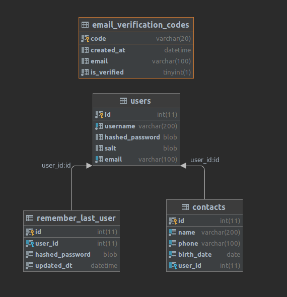

# qt_phone_book
test for Vista

тестировалось на linux mint 20

вывод mariadb --version:
mariadb  Ver 15.1 Distrib 10.3.31-MariaDB

1. установить требуемые пакеты (pip freeze > requirements.txt)
2. переименовать .env.template в .env
3. прописать конфигурацию почты и бд в файл .env
4. запустить python main.py

